# 📱 Praktikum Flutter — Hello World & Widget Dasar  

**Mata Kuliah:** Pemrograman Mobile  
**Dosen Pengampu:** Ade Ismail, S.Kom., M.TI  
**Nama:** Aqueena Regita Hapsari  
**NIM:** 2341760096  
**Kelas:** SIB 3C  
**No Absen:** 06

**Repository:** [flutter-fundamental-part1](https://github.com/aqwenaaa/flutter-fundamental-part1.git)  

---

## 📝 Daftar Praktikum
1. Praktikum 1 — Membuat Project Flutter Baru  
2. Praktikum 2 — Menjalankan Aplikasi pada Emulator & Perangkat Fisik  
3. Praktikum 3 — Integrasi GitHub & Dokumentasi  
4. Praktikum 4 — Widget Dasar (Text & Image)  
5. Praktikum 5 — Material Design & Cupertino Widgets  
6. Codelabs — Your First Flutter App  

---

## 📌 Praktikum 1: Membuat Project Flutter Baru
- Membuat project `hello_world` dengan **VS Code**.  
- Struktur project berhasil dibuat dengan pesan: `Your Flutter Project is ready!`.  
- Output awal adalah aplikasi counter bawaan Flutter.  

📷 **Screenshot:**  
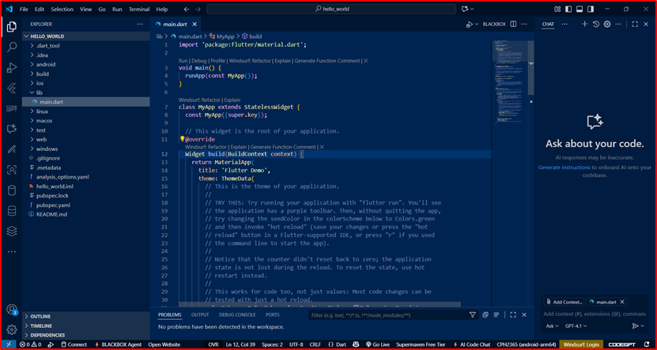

---

## 📌 Praktikum 2: Menjalankan Aplikasi di Emulator & Perangkat Fisik
- Aplikasi dijalankan pada **emulator Android** dan **device fisik (HP Android)**.  
- Nama & NIM ditampilkan pada tampilan aplikasi untuk identitas.  

📷 **Screenshot Emulator:**  
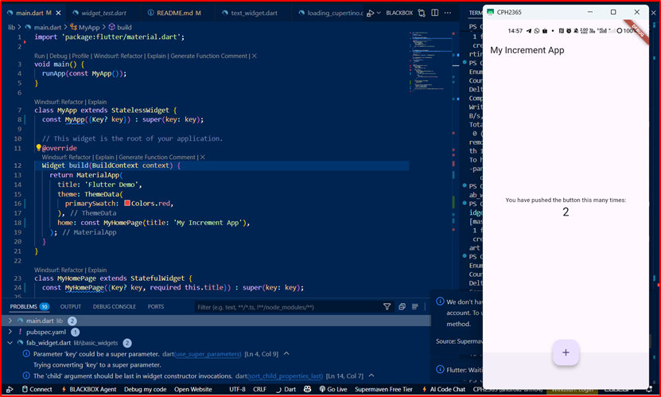

📷 **Screenshot Device Fisik:**  
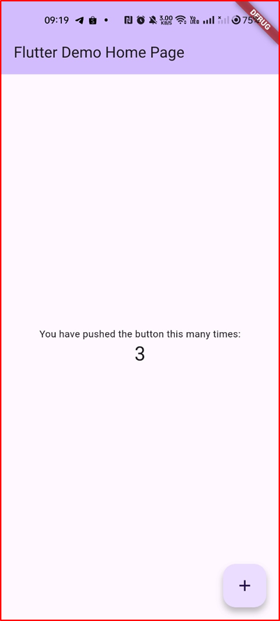

---

## 📌 Praktikum 3: Integrasi GitHub & Dokumentasi
- Membuat repository GitHub: `flutter-fundamental-part1`.  
- Melakukan **init, add remote, commit, push** dari VS Code.  
- Semua file (source + README + screenshot) sudah terdokumentasi.  

📷 **Screenshot Repo GitHub:**  
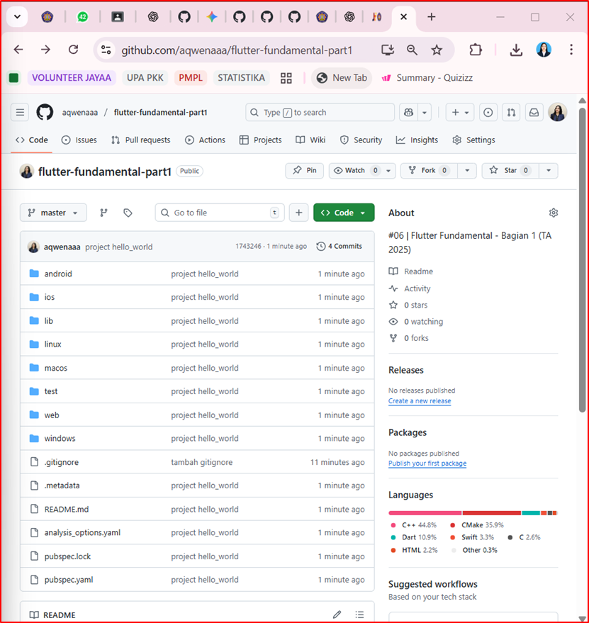

---

## 📌 Praktikum 4: Widget Dasar
### 🔹 Langkah 1 — Text Widget
Menampilkan teks dengan gaya warna merah dan ukuran font 14.  

📷 **Screenshot:**  
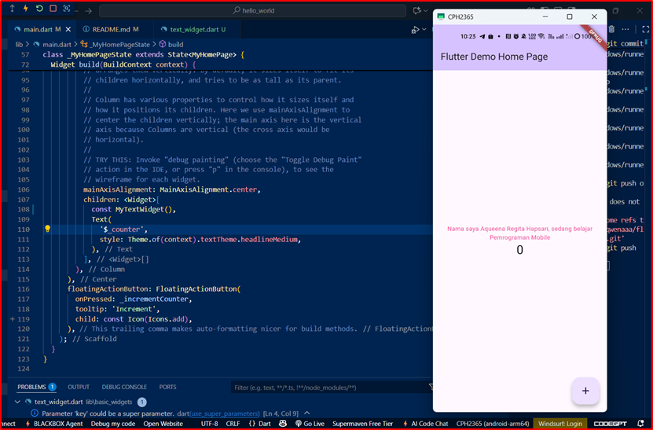  

### 🔹 Langkah 2 — Image Widget
Menampilkan gambar dari `assets/logo_polinema.jpg`.  

📷 **Screenshot:**  
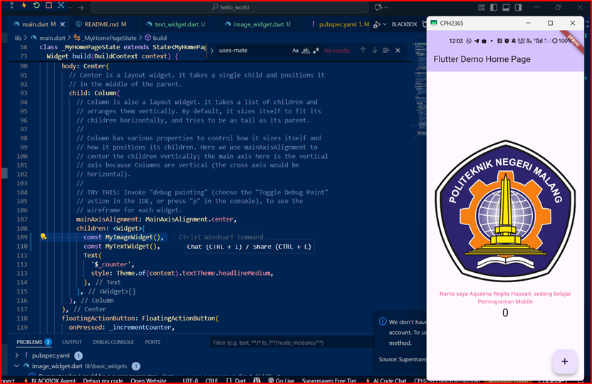  

---

## 📌 Praktikum 5: Widget Material Design & Cupertino
### 🔹 Langkah 1 — Cupertino Button & Loading  
📷 **Screenshot:**  
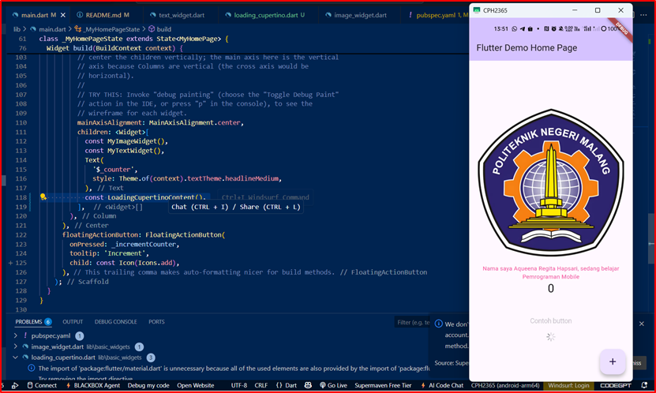  

### 🔹 Langkah 2 — Floating Action Button (FAB)  
📷 **Screenshot:**  
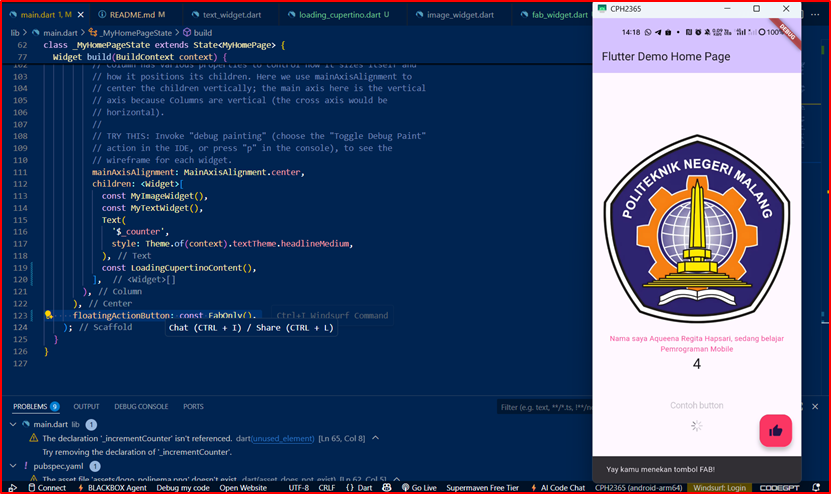  

### 🔹 Langkah 3 — Scaffold Widget  
📷 **Screenshot:**  
  

### 🔹 Langkah 4 — Dialog Widget  
📷 **Screenshot:**  
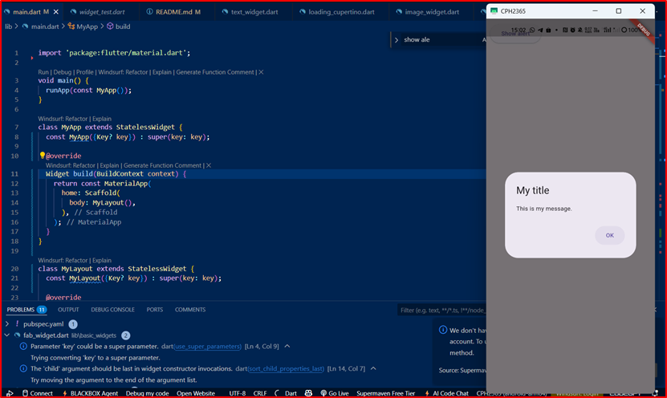  

### 🔹 Langkah 5 — Input & Selection (TextField)  
📷 **Screenshot:**  
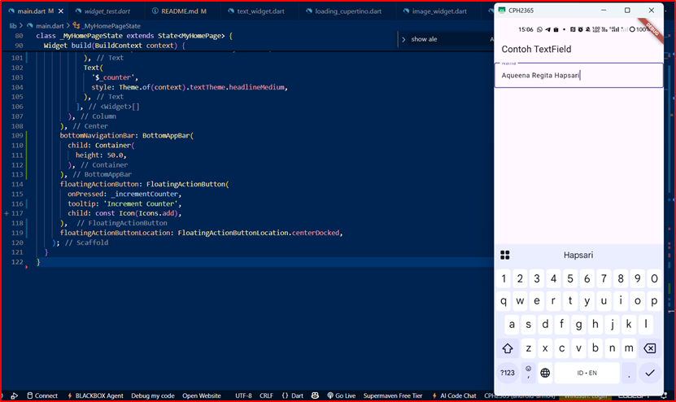  

### 🔹 Langkah 6 — Date Picker  
📷 **Screenshot:**  
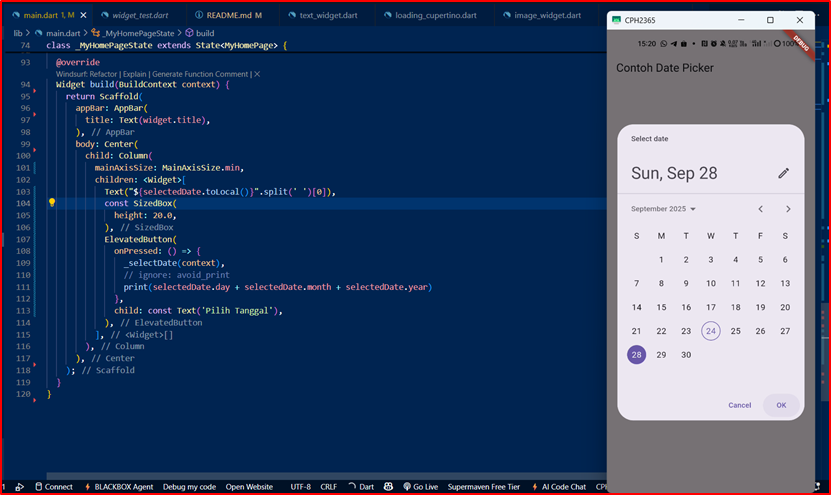  

---

## 📌 Codelabs: Your First Flutter App
- Menyelesaikan codelabs resmi Flutter.  
- Aplikasi berhasil dijalankan sesuai tutorial.  

📷 **Screenshot:**  
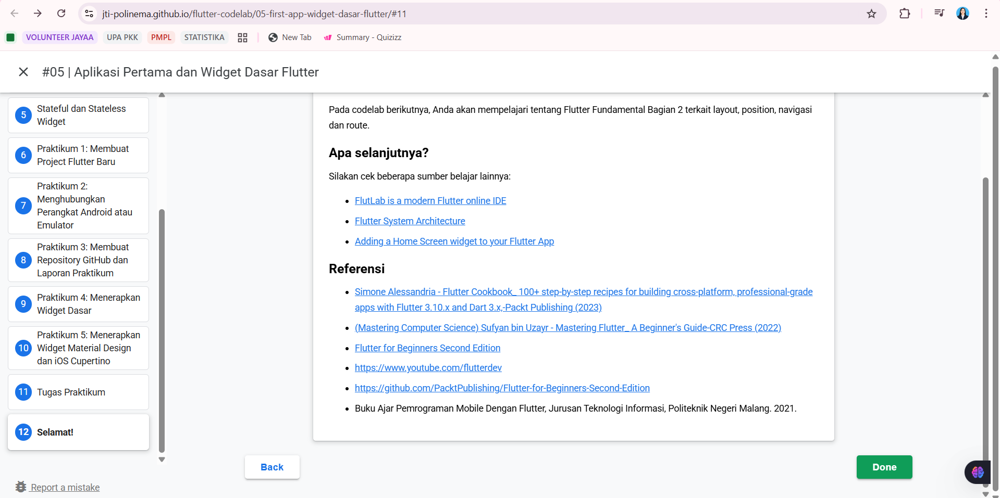  

---

## 📎 Referensi
- Simone Alessandria, *Flutter Cookbook*, Packt Publishing, 2023  
- Sufyan bin Uzayr, *Mastering Flutter: A Beginner’s Guide*, CRC Press, 2022  
- *Flutter for Beginners*, 2nd Edition  
- Buku Ajar *Pemrograman Mobile dengan Flutter*, Polinema, 2021  
- [Flutter Documentation](https://docs.flutter.dev/)  
- [FlutterDev YouTube Channel](https://www.youtube.com/flutterdev)  
